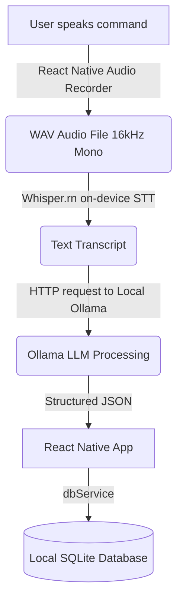

# Voice to Task (React Native)

A React Native mobile application that converts spoken commands into structured, locally stored tasks — fully local, no paid APIs.

**Example:** Say *"Remind me to call John tomorrow at 5 PM"* → get a saved task with `task`, `date`, and `time` fields.

---

## How It Works (System Architecture)



1. **Capture Voice**: Audio is recorded on the device using `react-native-audio-recorder-player` in 16kHz mono WAV format (ideal for speech recognition).
2. **Speech-to-Text (STT)**: Transcribed locally on-device using Whisper (`whisper.rn`, which wraps `whisper.cpp`). No audio data leaves the phone.
3. **Structured Entity Extraction**: The plain text is sent to a local Ollama instance on your LAN, which extracts the task name, date, and time, resolving relative values (like "tomorrow") based on the current date.
4. **Local Database**: Tasks are saved inside a local SQLite database (`react-native-sqlite-storage`) for offline lookup and manipulation.

---

## Setup Guide

Follow these steps to configure your environment and run the application.

### 1. Developer PC Setup

Your PC serves as the local development server (Metro bundler) and hosts the LLM server (Ollama).

#### A. Install Node Dependencies
Open your terminal in the project directory and run:
```bash
npm install
```

#### B. Install and Configure Ollama
1. Download and install [Ollama](https://ollama.com).
2. Download the default model (e.g. `llama3.1` or `llama3`):
   ```bash
   ollama pull llama3.1
   ```
3. **Crucial (Network Sharing)**: By default, Ollama only listens to `localhost` (`127.0.0.1`). To allow your mobile phone or emulator to talk to it, you must configure Ollama to bind to all interfaces:
   - **Windows**: Stop Ollama from the system tray. Open a PowerShell/CMD prompt and run:
     ```powershell
     $env:OLLAMA_HOST="0.0.0.0"
     ollama serve
     ```
   - **Mac/Linux**: Run:
     ```bash
     OLLAMA_HOST=0.0.0.0 ollama serve
     ```

#### C. Set the Host IP in Code
1. Find your PC's local LAN IP address (e.g. `192.168.1.50`).
2. Update the `OLLAMA_HOST` variable in [ollamaService.ts](file:///e:/Operations/V-T%20App/src/services/ollamaService.ts):
   ```typescript
   const OLLAMA_HOST = 'http://<your-pc-ip>:11434';
   ```

#### D. Start the Metro Bundler
Start the React Native development packager:
```bash
npm start
```

---

### 2. Mobile Device Setup

#### A. Whisper Model File
`whisper.rn` runs the model fully on-device.
1. Download a GGML model (e.g., [ggml-tiny.bin](https://huggingface.co/ggerganov/whisper.cpp/tree/main) (~75MB)).
2. **For Emulators/Simulators**:
   Place the model file inside the application's document directory (`DocumentDirectoryPath`), as specified in [whisperService.ts](file:///e:/Operations/V-T%20App/src/services/whisperService.ts#L19).
   *Note: In production, the app should download this file on the first boot or bundle it into the app assets.*

#### B. Platform Requirements & Permissions
- **Android**:
  - Make sure you have the Android SDK installed.
  - The permission `android.permission.RECORD_AUDIO` is requested at runtime. Ensure it is declared in `android/app/src/main/AndroidManifest.xml`.
- **iOS**:
  - Run `pod install` in the `ios` directory:
    ```bash
    cd ios && pod install && cd ..
    ```
  - Ensure `NSMicrophoneUsageDescription` is added to `Info.plist` with a description (e.g., "This app requires microphone access to transcribe voice tasks").

#### C. Run the Application
Deploy and launch the app on your connected device or simulator:

- **Android**:
  ```bash
  npm run android
  ```
- **iOS**:
  ```bash
  npm run ios
  ```

---

## Testing / Local Simulation

If you do not have an active Android/iOS device configured yet, you can run a **mock simulation** on your PC to test the business logic of all services:
```bash
npx ts-node scratch/simulate.ts
```
This script runs in the Node environment, mocks out the React Native native modules, and verifies:
- Whisper audio path routing
- Ollama task extraction (with live network fallback testing)
- SQLite database writes and reads
