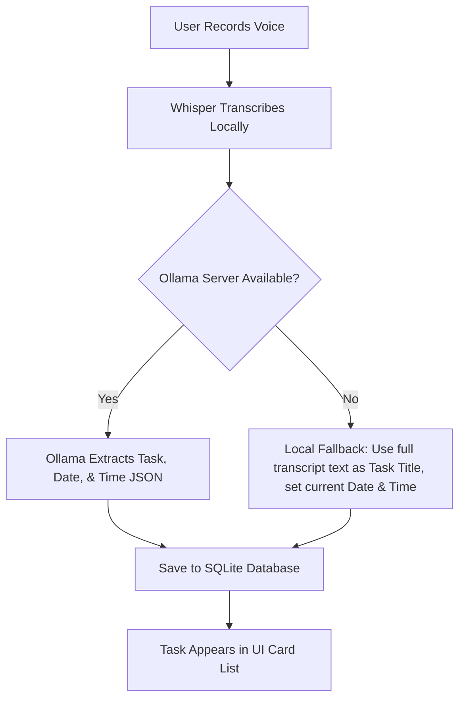

# Running and Testing the App Without Ollama

This guide details how to run, test, and use the application without having Ollama installed, running, or configured on your network.

---

## 1. How the Offline Fallback Works

We modified the application's task extractor in [ollamaService.ts](file:///e:/Operations/V-T%20App/src/services/ollamaService.ts) to handle offline states gracefully:



If the app cannot connect to Ollama (for instance, if you didn't run Ollama, or configured a wrong IP address), it will catch the network error, log a warning, and fall back to local heuristics:
- **Task Title**: Saved as the full transcribed sentence (e.g. *"Remind me to call John tomorrow at 5 PM"*).
- **Date**: Defaults to today's date (`YYYY-MM-DD`).
- **Time**: Defaults to the current system time (`HH:mm`).

---

## 2. Step-by-Step Instructions to Run the App

Follow these steps to run the application fully without Ollama:

### Step 1: Install Dependencies
Open a terminal in the project root directory and run:
```bash
npm install
```

### Step 2: Start the Metro Bundler
Start the development bundler that serves JavaScript to the mobile app:
```bash
npm start
```

### Step 3: Run the Application
Open a new terminal session and run the app on your mobile device, emulator, or simulator:

- **Android**:
  ```bash
  npm run android
  ```
- **iOS**:
  ```bash
  npm run ios
  ```

### Step 4: Verify the Offline Fallback in Action
1. Tap the **Microphone (🎤)** button in the app.
2. Speak a task (e.g., *"Buy groceries tonight"*).
3. Tap the button again to stop.
4. The status label will transition:
   `Listening...` → `Transcribing...` → `Extracting task details...` → `Saved: "Buy groceries tonight"`.
5. Since Ollama is offline, the console will log a warning, and a task card containing your exact spoken transcript (*"Buy groceries tonight"*) with today's date and time will successfully populate your list!

---

## 3. Verify via PC Simulation

You can verify this exact fallback behavior on your PC right now without loading a phone emulator:
```bash
npx ts-node scratch/simulate.ts
```
The terminal log will output:
```text
--- TEST 2: Extracting task details ---
[Ollama Network Simulation] Attempting connection to local Ollama server...
[Ollama Mock] Ollama server offline. Falling back to mocked local AI response.
```
And will successfully save the fallback task object directly to the mock database.
